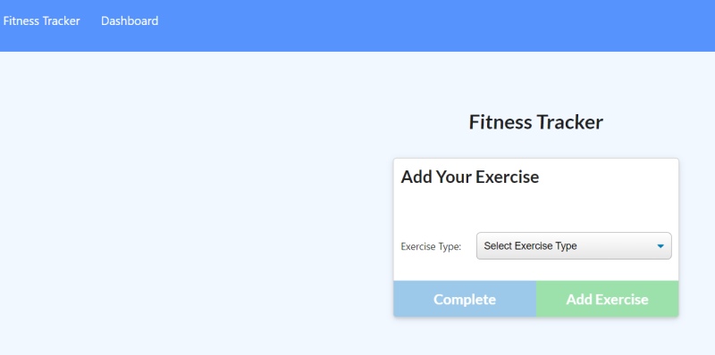
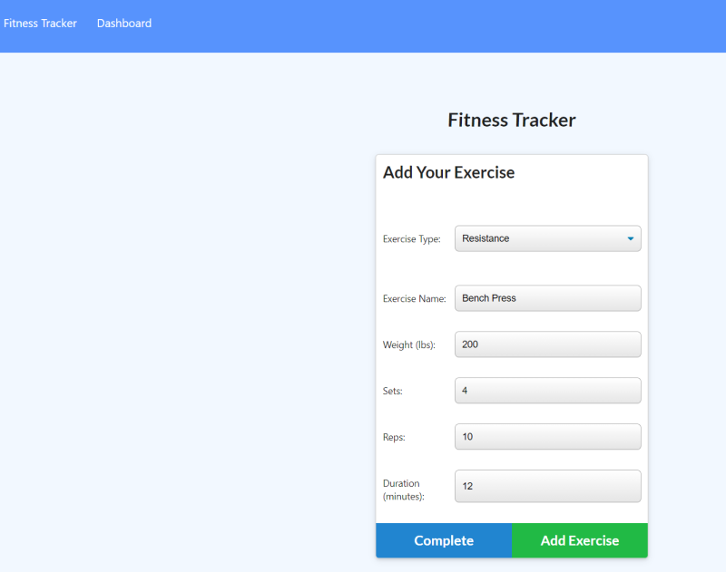
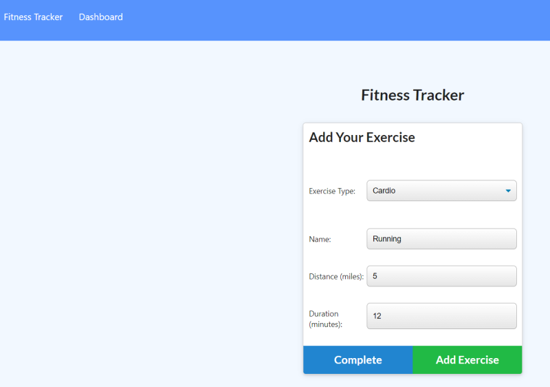
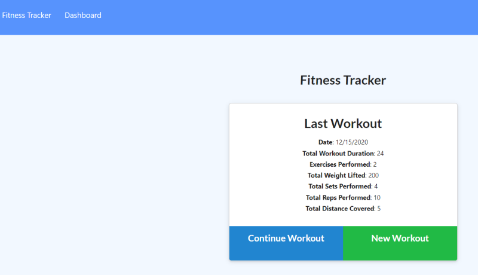
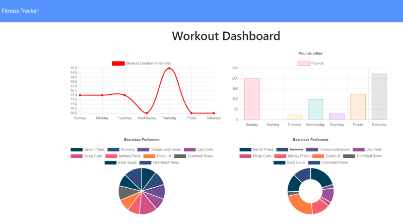

# 17-Workout Tracker
___
## Objective
Create a workout tracker with the provided front end code using a Mongo database with a Mongoose schema, and handle routes with Express.
___
## Table of Contents
* [User_Story](#user_story)
* [Installation](#installation)
* [Usage](#usage)
* [License](#license)
* [Contributing](#contributing)
* [Questions](#questions)
* [Application_Links_and_Images](#application_links_and_images)
## User_Story:
 As a user, I want to be able to view, create, and track daily workouts. I want to be able to log multiple exercises in a workout on a given day. I should also be able to track the name, type, weight, sets, reps, and duration of exercise. If the exercise is a cardio exercise, I should be able to track my distance traveled.  
___
## Installation
(1) Go to the `server.js` file, right-click, open in integrated terminal, and type: **npm i** (install) to install all required dependencies for the app   
(2) Invoke the app by typing: **node server.js**    
(3) App is running on **localhost:3000**   
(4) Go to Google Chrome, and type URL: **localhost:3000**   
(5) The app is now running and the user can create a **New Workout**, **Continue Workout**, or view previous workouts by clicking on **Dashboard** on the left side of the navbar.  
   
_____
## Usage
A consumer will reach their fitness goals more quickly when they track the progress of their workouts.   

This App allows users to track the progress of their workouts by entering the exercise resistance and cardio data into the associated fields.  They can then track their progress to reach desired fitness goals. 

The user has the ability to:   
* Add exercises to a previous workout plan.
* Add new exercises to a new workout plan.
* View the combined weight of multiple exercises on the `Dashboard` page.
_____
## Contributing
ed-sivick, Stack Overflow, Grepper, Katheryn at AskBCS Learning Assistant for functionality, code syntax, and Heroku deployment instruction
_____
## Questions
If there are any questions, or if you would prefer more information concerning this app,
please contact the following person at their GitHub profile or email address below:

* [GitHub Profile](https://github.com/ed-sivick)
* ed@sivick.net
_____
## License
You can view more information concerning software licenses at the following link:

* [License](https://opensource.org/licenses/MIT)
_____
## Badges

___
## Application_Links_and_Images  
**Links:**  
Heroku link: (https://whispering-headland-52819.herokuapp.com/)   

**Application Image Examples:** 

<strong>Image of Fitness Tracker screen to select an exercise type</strong>

  
  
 

<strong>Image of Fitness Tracker screen to add Resistance exercise data</strong>

  

  
  

  
 
  

<strong>Image of Fitness Tracker screen to add Cardio exercise data</strong>

  

  
  
 

<strong>Image of Fitness Tracker screen to display Last Workout exercise data</strong>

  

  
  
 

  
<strong>Image of Workout Dashboard screen to display a Workout exercise summary</strong>

  

  
  
 